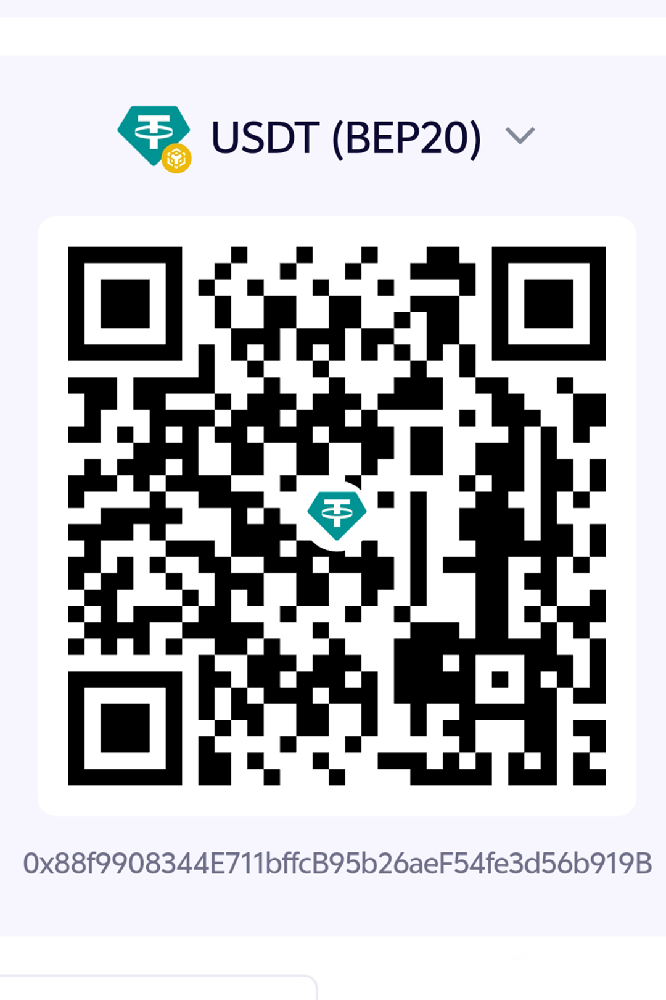

<p align="center">
    
</p>
<p align="center">
    <h1 align="center">CunInbox</h1>
    <p align="center">AI 驱动的个人数字身份邮箱系统 · 基于域名邮箱管理你的互联网数字身份</p>
    <p align="center">
        <a href="LICENSE" target="_blank" >
            
        </a>
        <a href="https://github.com/cunzhangcrypto/CunInbox/releases" target="_blank" >
            
        </a>
        <a href="https://github.com/cunzhangcrypto/CunInbox/issues" >
            
        </a>
        <a href="https://github.com/cunzhangcrypto/CunInbox/stargazers" target="_blank">
            
        </a>
        <a href="https://github.com/cunzhangcrypto/CunInbox/forks" target="_blank" >
            
        </a>
    </p>
</p>

---

## 项目简介

**CunInbox 是一个 AI 驱动的个人数字身份中心，通过自有域名邮箱帮助用户管理互联网账号、通信记录和在线身份。**

它不是普通的邮件服务或 Gmail 替代品，而是你在互联网上的「数字身份控制台」：注册了哪些网站、多久没登录、哪些账号有安全风险、全部通信来往记录、服务的生命周期……统一由 CunInbox 接管。在 Cloudflare Workers 上一键部署，个人使用几乎零成本。

## 核心功能

| 功能 | 说明 |
| --- | --- |
| 🪪 **数字身份管理** | 自动识别 / 手动录入你在各个平台的账户，按「开发 / AI / 云服务 / 社交 / 娱乐 / 电商 / 工具」分类，标注状态与用途 |
| ✉️ **邮箱别名系统** | 基于你的域名，每个平台/场景分配一个独立邮箱别名，泄露即禁用，告别批量邮件骚扰 |
| 🤖 **AI 邮件理解与分类** | 自动识别「注册 / 验证 / 安全 / 账单 / 更新 / 营销 / 社交 / 开发 / 资讯 / AI」类别，准确率可视化 |
| 🔍 **AI 自动数字身份发现** | 扫描所有历史邮件，自动发现你注册过但忘记的互联网服务，置信度打分，一键确认入库 |
| 📰 **AI 每日摘要 (CunInbox Daily)** | 每天凌晨汇总昨日通信 + 新身份发现 + 安全建议，终端 HUD 风格呈现 |
| 🛡️ **数字身份安全中心** | 异常登录、未处理风险事件、长期未使用身份、高危账号多维度监测 |
| ♻️ **服务生命周期管理** | 记录每个数字身份的使用频率和最近活跃时间，标记「建议停用」，跟踪注销进度 |
| 💬 **AI 对话助手** | 问任意关于你的数字身份 / 邮件 / 安全的问题，调用配置的 AI 模型回答 |
| 📧 **邮件收发 / 星标 / 草稿 / 群发** | 完整的邮件客户端能力，附件走 Cloudflare R2（免出站流量费） |
| 🔔 **多通道通知推送** | 接收到重要邮件后，自动转发到 Telegram 机器人或任意第三方邮箱 |
| 🧑‍💼 **管理员后台 + RBAC 权限** | 用户、邮件、角色、密钥、注册策略、系统参数全量配置 |
| 🎨 **深空科技感 UI** | 深太空蓝黑基调 + 青紫霓虹辉光 + HUD 风格卡片 + 自动扫光动效 |
| 📱 **响应式 + PWA** | PC、手机浏览器自适应，可添加到桌面脱机使用 |

## 产品定位

```
普通邮箱服务 (Gmail / QQmail / Outlook)
  ↓ 只管收发邮件
CunInbox
  ↓ 把「邮箱」升级成「数字身份操作系统」
     一个域名 → 无限个别名邮箱 → N 个平台账号 → 统一管理 + AI 守护
```

## 技术栈

| 层级 | 技术 |
| --- | --- |
| **运行平台** | [Cloudflare Workers](https://developers.cloudflare.com/workers/) (Serverless 边缘函数) |
| **Web 框架** | [Hono](https://hono.dev/) |
| **ORM** | [Drizzle](https://orm.drizzle.team/) |
| **数据库** | [Cloudflare D1](https://developers.cloudflare.com/d1/) (Serverless SQLite) |
| **对象存储** | [Cloudflare R2](https://developers.cloudflare.com/r2/) (无出站流量费) + S3 兼容接口可选 |
| **键值缓存** | [Cloudflare KV](https://developers.cloudflare.com/kv/) |
| **AI 能力** | Cloudflare Workers AI（内置免费额度）/ DeepSeek / 任意 OpenAI 兼容接口，**支持主用失败自动降级** |
| **前端框架** | [Vue 3](https://cn.vuejs.org/) + [Vite](https://cn.vitejs.dev/) |
| **UI 组件库** | [Element Plus](https://element-plus.org/zh-CN/) |
| **状态管理** | Pinia |
| **发信服务** | [Resend](https://resend.com/) |
| **收信服务** | Cloudflare Email Routing（100% 免费） |
| **人机验证** | Cloudflare Turnstile（替代 reCAPTCHA，完全免费） |

## 目录结构

```
CunInbox/
├── mail-worker/              # Cloudflare Worker 后端项目
│   ├── src/
│   │   ├── api/              # 接口层 (user/account/email/ai/identity/security/...)
│   │   ├── const/            # 项目常量 & 枚举
│   │   ├── dao/              # 数据访问层
│   │   ├── email/            # 邮件接收钩子 (Email Routing → Worker)
│   │   ├── entity/           # D1 表定义 & Drizzle schema
│   │   ├── error/            # 自定义 BizError
│   │   ├── hono/             # Hono 框架初始化 / 拦截器 / 全局异常
│   │   ├── i18n/             # 多语言 (zh / en)
│   │   ├── init/             # 数据库 & KV 初始化 & 数据迁移
│   │   ├── model/            # 响应体 result 封装
│   │   ├── security/         # JWT 鉴权 & 用户上下文
│   │   ├── service/          # 业务逻辑层 (ai-service / identity / security / digest ...)
│   │   ├── template/         # 邮件消息模板
│   │   ├── utils/            # 工具函数集
│   │   └── index.js          # Worker 入口
│   ├── wrangler.toml         # 默认配置模板
│   ├── wrangler-action.toml  # GitHub Action 部署用
│   ├── wrangler-dev.toml     # 本地开发用
│   └── package.json
│
├── mail-vue/                 # Vue 3 前端项目
│   ├── src/
│   │   ├── axios/            # Axios 封装 + Demo 模式 Adapter
│   │   ├── components/       # 公共组件 (logo / email-scroll / tiny-editor / loading ...)
│   │   ├── demo/             # 演示模式 Mock 数据 (data.js) & 请求路由 (index.js)
│   │   ├── echarts/          # 图表导入
│   │   ├── enums/            # 前端枚举
│   │   ├── i18n/             # 多语言
│   │   ├── init/             # 前端入口初始化 (设置加载 / demo 模式)
│   │   ├── layout/           # 主体布局 (侧边栏 / 顶栏 / 写信面板 ...)
│   │   ├── perm/             # 前端 RBAC 权限指令
│   │   ├── request/          # API 请求封装 (按模块拆分)
│   │   ├── router/           # 路由配置
│   │   ├── store/            # Pinia 全局状态
│   │   ├── utils/            # 工具函数
│   │   ├── views/            # 页面 (dashboard / identity / assistant / security / email ...)
│   │   ├── App.vue
│   │   ├── main.js
│   │   └── style.css         # 全局主题 (深空青紫色系)
│   ├── .env.demo             # 演示模式：VITE_DEMO_MODE=true
│   ├── .env.dev / .env.release / .env.remote
│   └── vite.config.js
│
├── assets/logo/              # 品牌资源 (HD 方形 logo / 品牌横幅)
├── doc/                      # 文档 & 截图
├── .github/workflows/        # GitHub Action 部署流水线
├── README.md / README-en.md
└── LICENSE (MIT)
```

---

## 部署步骤

CunInbox 推荐两种部署方式：**GitHub Action 一键部署**（零配置、最简单）和 **本地 Wrangler 手动部署**（灵活）。

### 前置准备（两种方式都需要）

1. **一个 Cloudflare 账号**（免费用户即可，个人用量免费额度完全够用）
2. **一个自己的域名**（例如 `cuninbox.ai`，邮件服务离不开域名），已加到 Cloudflare 账户中
3. Node.js ≥ 20 + **pnpm**（`npm i -g pnpm`，项目使用 pnpm workspace）

### 方式一：GitHub Action 一键部署（推荐）

#### Step 1：在 Cloudflare 后台创建 4 个资源

登录 [Cloudflare Dashboard](https://dash.cloudflare.com/)：

1. **D1 数据库**：左侧菜单「D1 SQL Database」→「Create」命名为 `cuninbox`，记下 `Database ID`
2. **KV 命名空间**：左侧菜单「KV」→「Create a namespace」命名任意，记下 `Namespace ID`
3. **R2 存储桶**：左侧菜单「R2」→「Create bucket」命名任意（例如 `cuninbox-assets`），记下桶名
4. **Workers AI（可选）**：在「Workers & Pages」→「AI」页面，绑定 Workers AI（推荐，有免费额度）

> Cloudflare 免费用户这 4 项都可以创建，个人免费额度足够。

#### Step 2：创建 Cloudflare API Token

进入 [API Tokens 页面](https://dash.cloudflare.com/profile/api-tokens)：
- 选择「Use template → Edit Cloudflare Workers」模板
- 额外添加 **D1 / KV / R2 / Account Settings / Zone Settings** 的「Edit」权限
- 生成 Token 后复制保存（只显示一次）

同时复制 Cloudflare 账户 ID（Workers 首页右上角或 URL 里）。

#### Step 3：在 GitHub 仓库配置 Secrets

Fork 本仓库到自己的账号，然后：
`仓库 → Settings → Secrets and variables → Actions → New repository secret`

添加以下 Secrets：

| Secret 名 | 说明 | 示例 |
| --- | --- | --- |
| `CLOUDFLARE_API_TOKEN` | ✅ Step 2 中创建的 API Token | `xyzabc...` |
| `CLOUDFLARE_ACCOUNT_ID` | ✅ Cloudflare 账户 ID | `7f123abc...` |
| `D1_DATABASE_ID` | ✅ Step 1 的 D1 Database ID | `a123...` |
| `KV_NAMESPACE_ID` | ✅ Step 1 的 KV Namespace ID | `b456...` |
| `R2_BUCKET_NAME` | ✅ Step 1 的 R2 bucket 名 | `cuninbox-assets` |
| `DOMAIN` | ✅ 邮件域名（**JSON 数组格式**） | `["yourdomain.com"]` |
| `ADMIN` | ✅ 初始管理员邮箱 | `admin@yourdomain.com` |
| `JWT_SECRET` | ✅ JWT 签名密钥（任意长随机字符串，不能含 `? % # / \`） | `MyVeryStr0ngS3cret-9527!` |
| `NAME` | ❌ Worker 项目名，默认 `cuninbox` | `cuninbox` |
| `CUSTOM_DOMAIN` | ❌ 绑定自定义域名（Worker 访问路径），不填就用 workers.dev 子域 | `cuninbox.yourdomain.com` |

#### Step 4：运行 Action 自动部署

- 方式一：直接 push 到 `main` 分支的 `mail-worker/**` 或 `mail-vue/**` 自动触发
- 方式二：`Actions → 🚀 Deploy cuninbox to Cloudflare Workers → Run workflow` 手动触发

等待约 2 分钟即可完成部署。

#### Step 5：初始化数据库 & 创建管理员账号

部署完成后，首次访问：

```
https://{你的 Worker 域名}/api/init/{JWT_SECRET}
```

浏览器打开后看到 `init success` 即表示 D1 建表完成。
然后打开系统，用 `ADMIN` 邮箱注册，首个注册用户自动成为管理员。

#### Step 6：配置 Cloudflare Email Routing 收信

为了让 Worker 能真正接收到邮件（数字身份发现 / 邮件管理的基础）：
1. 进入 **你的域名 → Email → Email Routing**，开启
2. Catch-all 地址 / 路由规则 → 「Send to Worker」，选择刚才部署的 Worker
3. 完成 MX / TXT 记录检查（Cloudflare 会自动填好）

> 这一步完成后，`任意前缀@你的域名` 的邮件都会被 CunInbox Worker 接收并写入 D1。

### 方式二：本地 Wrangler 手动部署

```bash
# 1. 克隆 & 安装
git clone https://github.com/cunzhangcrypto/CunInbox.git
cd CunInbox
cd mail-worker && pnpm install
cd ../mail-vue && pnpm install

# 2. 编写 wrangler.toml
cd ../mail-worker
# 直接编辑仓库自带的 wrangler.toml，取消注释并填写：
#   [[d1_databases]] database_id = 你的D1ID
#   [[kv_namespaces]] id = 你的KVID
#   [[r2_buckets]] bucket_name = 你的桶名
#   [vars] domain = ["你的域名"]  admin = "你的管理员邮箱"  jwt_secret = "一串随机字符串"

# 3. 登录 wrangler（首次）
pnpm wrangler login

# 4. 一键部署 (wrangler.toml 的 build 命令会自动 build 前端到 ./dist)
pnpm run deploy

# 5. 初始化 D1 数据库
# 浏览器打开
# https://{worker域名}/api/init/{你配置的 jwt_secret}
```

然后同「方式一」的 Step 6 开启 Email Routing。

---

## 本地开发

```bash
# 后端 (另开一个终端)
cd mail-worker
pnpm install
pnpm run dev        # 默认端口约 8787

# 前端 (另开一个终端)
cd mail-vue
pnpm install
# 开发模式（请求到本地 Worker，需要先启后端）
pnpm run dev        # Vite 端口约 3000
```

## 演示站（纯静态，零后端）

你可以把 CunInbox 打包成一个纯静态演示站，不连任何 API，所有数据都是 Mock。用户可以直接在浏览器里看完所有界面，写操作会提示「此为演示版本，该功能请正式部署后使用」。

```bash
cd mail-vue
pnpm install
pnpm run build:demo   # 输出到 mail-vue/dist-demo/

# 本地预览
pnpm vite preview --outDir dist-demo --port 3002

# 或直接把 dist-demo 目录部署到 Cloudflare Pages / Netlify / Vercel / GitHub Pages
```

核心参数见 [mail-vue/.env.demo](mail-vue/.env.demo)：`VITE_DEMO_MODE = 'true'` 会开启 Axios Demo Adapter，所有请求在前端本地拦截，数据来自 `src/demo/data.js`。

---

## 系统使用操作步骤

部署完成后，管理员日常使用流程：

### ① 首次登录 & 系统基础设置
1. 打开站点，点击「注册」，用配置的 `ADMIN` 邮箱注册 → 自动成为超级管理员
2. 左侧「系统设置」：
   - 填 **Resend Token**（要发邮件必须，免费档 100 封/天），保存后「测试发送」
   - **发信设置** → 配置每个域名的签名 DKIM（Resend 后台有详细指引）
   - **人机验证** → 填 Turnstile SiteKey / SecretKey（免费，防机器人注册）
   - **Telegram / 邮件转发** → 按需，接收邮件通知
   - **对象存储** → R2 正常已绑定；如需兼容 S3 可填 AWS Key
   - **AI 配置** → 主用 AI 默认 Workers AI（免费）；**建议同时启用自动降级并填 DeepSeek API Key**（超免费额度时自动切换）

### ② 添加第一个邮箱账户 & 别名
1. 左侧「账户管理」→「添加账户」，填一个前缀，比如 `me@你的域名`
2. 回到「首页 Dashboard」，可以看到邮箱数、身份数、安全事件等指标
3. 需要隐私隔离的服务，**用别名邮箱**：在平台注册时填 `github-xx@你的域名`，CunInbox 收到邮件后会自动归属到「GitHub」身份名下

### ③ 触发一次 AI 全量扫描（建立初始数字身份库）
1. 先用这个邮箱系统一段时间（或往账户转发几十封历史邮件）
2. 「系统设置 → AI 分析」一键跑批量分析，或等待每日定时任务
3. 进入「AI 助手 → 身份发现」标签页，查看 AI 自动发现的新平台，确认后加入数字身份库

### ④ 管理数字身份
1. 进入「数字身份」页面，按「开发 / AI / 云服务 / 社交 / 电商 / 娱乐 / 工具」分类浏览
2. 点「添加身份」录入手动身份；平台支持下拉选择（50+ 预置平台）或自定义输入
3. 编辑身份 → 填用途、账号名、绑定邮箱、最近登录时间，方便后续安全审计

### ⑤ 安全巡检
1. 「安全中心」查看 7 类安全事件：异常登录、高危风险、长期未用身份、安全邮件未处理、新身份未确认、可疑别名、泄露事件
2. 处理每一项后标记「已处理」，系统会重新统计高危 / 未处理数

### ⑥ 每日使用
- 打开 CunInbox 首页 Dashboard → 看一眼「今日 CunInbox Daily」AI 摘要，对过去 24 小时发生的事一目了然
- 收信 → 分类 / 星标 / 归档 / 转发到 TG
- 遇到关于「我有没有注册过 X？我某平台账号叫啥？最近有账单邮件吗？」直接问「AI 对话」

---

## 成本说明

| 项目 | 个人使用成本 |
| --- | --- |
| 域名年付 | ~¥70/年起（普通 .com；.ai 后缀较贵） |
| Cloudflare Workers / D1 / KV / R2 / Email Routing / Turnstile | **免费额度足够**，超出后按量计费 |
| Resend 发信 | 免费档 100 封/天，升级 $20/月 5 万封 |
| Workers AI（主用 AI） | 每天免费 10,000 Neurons，约几十~几百次调用，**CunInbox 内置失败自动降级** |
| DeepSeek / 自定义 AI（备选） | 约 ¥1 / 百万 tokens，个人用量每月几毛~几块 |
| **合计** | **每年几十块域名费即可跑起来** ✅ |

---

## 赞助

如果 CunInbox 对你有帮助，欢迎请村长喝杯咖啡 ☕ 你的支持是这个项目持续迭代的动力。

<table>
  <tr>
    <td align="center">
      
      <br/><sub>支付宝</sub>
    </td>
    <td align="center">
      
      <br/><sub>微信</sub>
    </td>
  </tr>
  <tr>
    <td align="center">
      
      <br/><sub>USDT-BEP20</sub>
    </td>
    <td align="center">
      
      <br/><sub>USDT-TRC20</sub>
    </td>
  </tr>
</table>

## 许可证

本项目采用 [MIT License](LICENSE) 开源许可证。

Copyright (c) 2026 cunzhangcrypto

Permission is hereby granted, free of charge, to any person obtaining a copy
of this software and associated documentation files (the "Software"), to deal
in the Software without restriction, including without limitation the rights
to use, copy, modify, merge, publish, distribute, sublicense, and/or sell
copies of the Software, and to permit persons to whom the Software is
furnished to do so, subject to the following conditions:

The above copyright notice and this permission notice shall be included in all
copies or substantial portions of the Software.

## 致谢

CunInbox 是基于开源项目 **[cloud-mail](https://github.com/jiangrenmao/cloud-mail)** 的二次开发版本，在此向原作者 [@jiangrenmao](https://github.com/jiangrenmao) 及 cloud-mail 社区贡献者表达诚挚谢意。

cloud-mail 同样采用 MIT License 开源，为本项目提供了完整的邮件系统底座（账户、邮件、附件、Resend 集成、Cloudflare 全家桶部署等），CunInbox 在此基础上扩展了：

- 🪪 数字身份管理系统
- 🤖 AI 邮件理解与自动分类
- 🔍 AI 自动数字身份发现
- 📰 CunInbox Daily 每日摘要
- 🛡️ 数字身份安全中心
- ♻️ 服务生命周期管理
- 💬 AI 对话助手（含主用失败自动降级）
- 🎨 深空科技感 UI 主题

感谢 cloud-mail 团队为开源社区作出的贡献。

## 交流

- [Telegram 群组](https://t.me/cunzhangtech)
- Issues / PRs 欢迎

